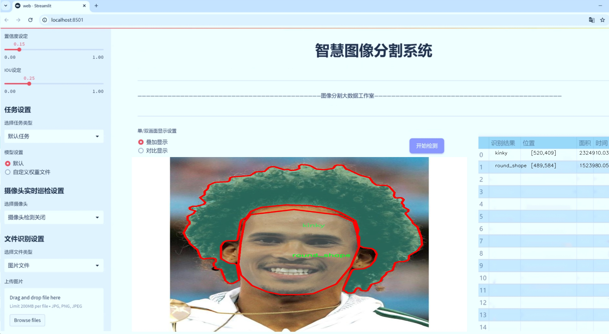
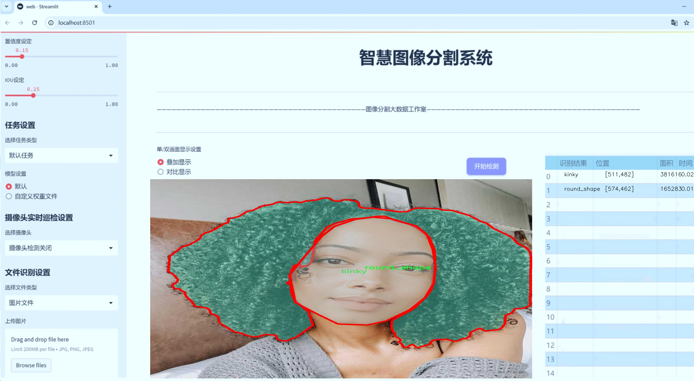
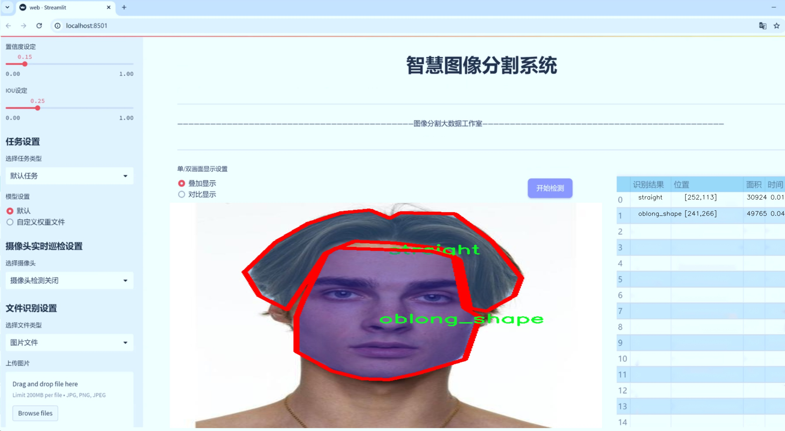
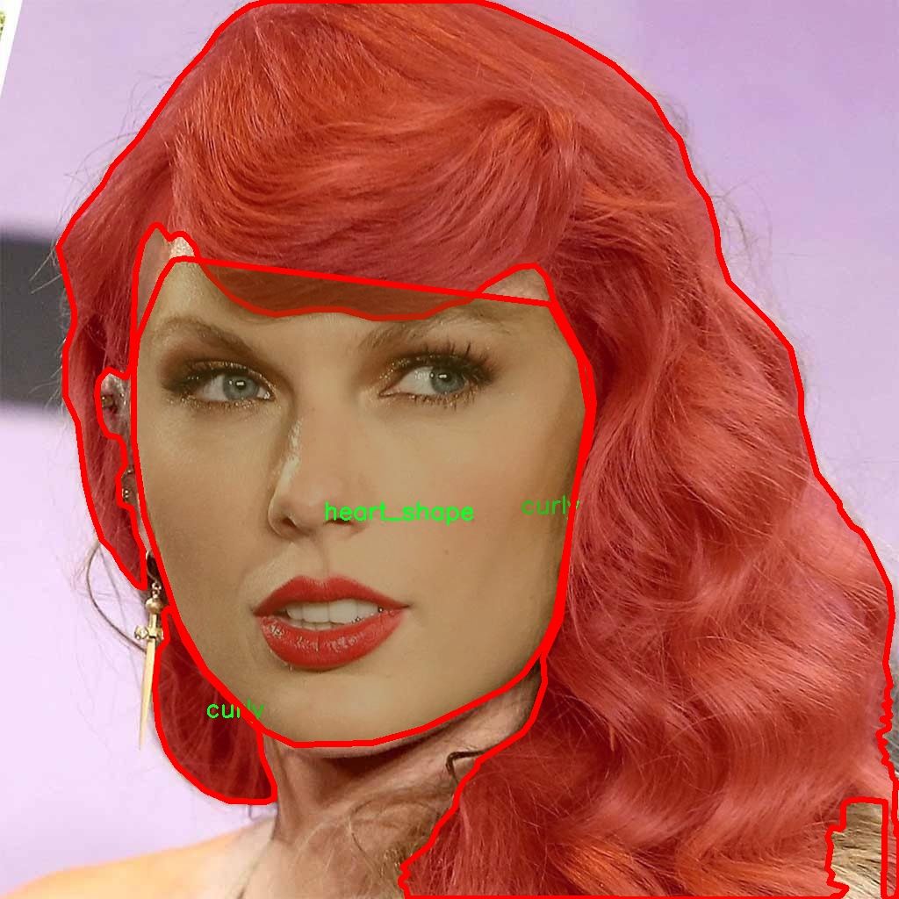
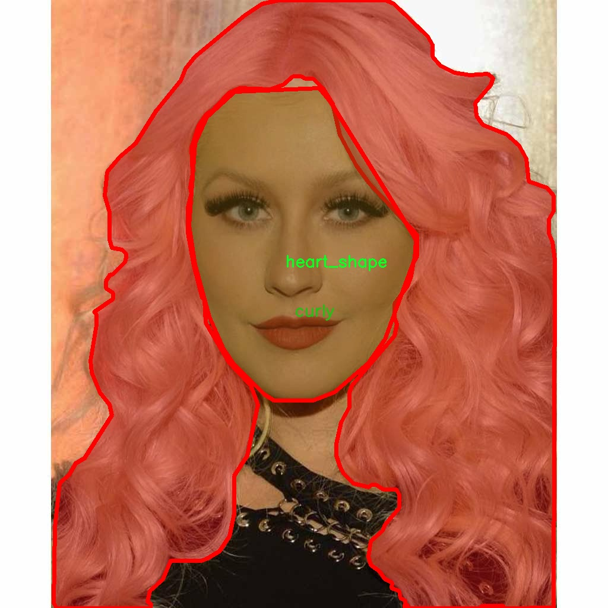
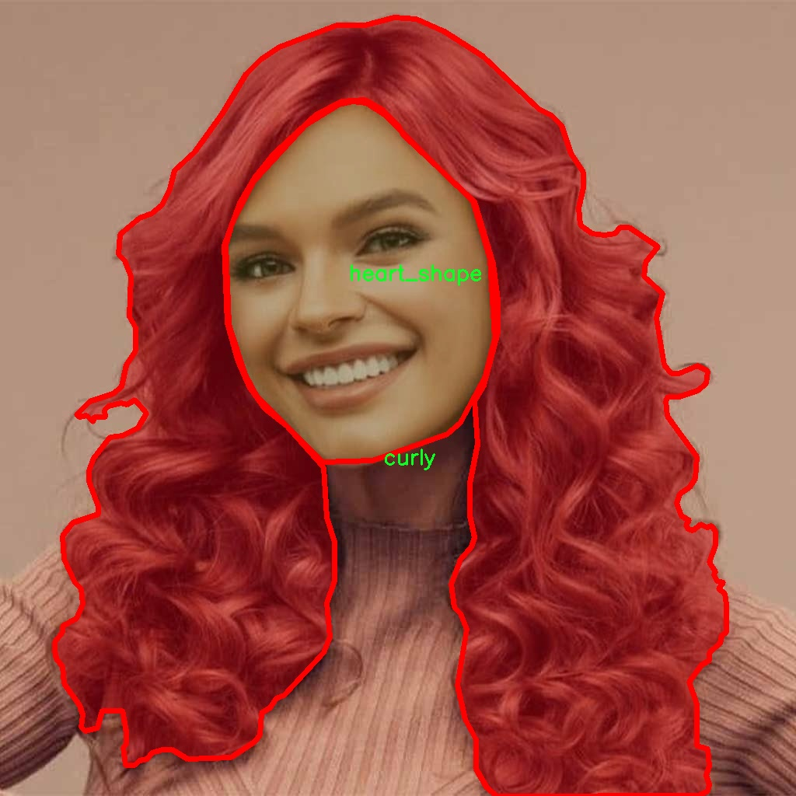
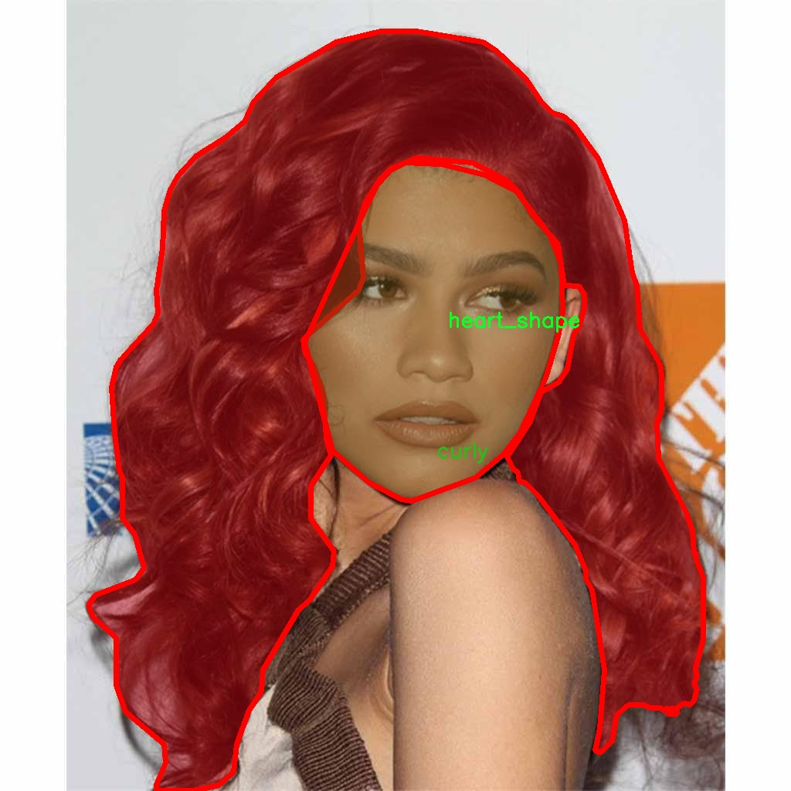
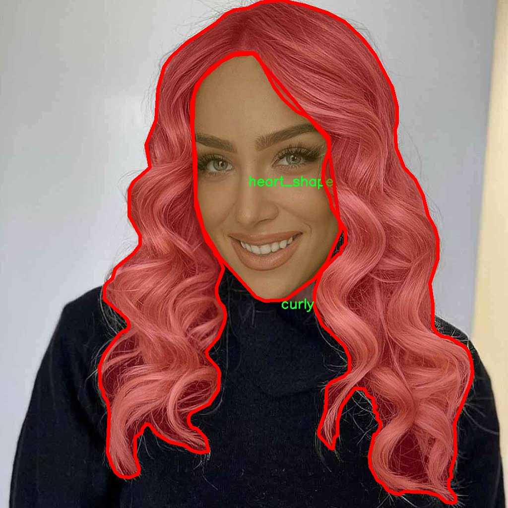

# 发型等面部特征形状分割系统源码＆数据集分享
 [yolov8-seg-C2f-SCConv＆yolov8-seg-C2f-RFCAConv等50+全套改进创新点发刊_一键训练教程_Web前端展示]

### 1.研究背景与意义

项目参考[ILSVRC ImageNet Large Scale Visual Recognition Challenge](https://gitee.com/YOLOv8_YOLOv11_Segmentation_Studio/projects)

项目来源[AAAI Global Al lnnovation Contest](https://kdocs.cn/l/cszuIiCKVNis)

研究背景与意义

随着计算机视觉技术的迅猛发展，面部特征的自动识别与分析在多个领域中展现出广泛的应用潜力，尤其是在美容、时尚、虚拟现实以及人机交互等领域。发型作为面部特征的重要组成部分，不仅影响个人形象的塑造，还在社交媒体、广告营销和个性化推荐等方面发挥着重要作用。因此，基于深度学习的发型及其他面部特征的形状分割系统的研究，具有重要的理论价值和实际意义。

近年来，YOLO（You Only Look Once）系列模型因其高效的实时目标检测能力而受到广泛关注。YOLOv8作为该系列的最新版本，结合了更为先进的网络结构和优化算法，能够在保证检测精度的同时，显著提高处理速度。然而，传统的YOLO模型在处理复杂的实例分割任务时，尤其是在细粒度特征的提取和形状分割方面，仍存在一定的局限性。因此，基于改进YOLOv8的发型等面部特征形状分割系统的构建，旨在通过对模型的优化与改进，提升其在细粒度特征分割任务中的表现。

本研究所使用的数据集“face-h 2”包含1200张图像，涵盖了9种不同的发型类别，包括卷发、心形、卷曲、长方形、椭圆形、圆形、方形、直发和波浪形。这一丰富的类别设置为模型的训练与评估提供了良好的基础，能够有效提升模型对多样化发型的识别能力。通过对这些面部特征的精确分割，研究不仅可以为发型推荐系统提供支持，还能为用户提供个性化的美容建议，进而推动美容行业的数字化转型。

此外，面部特征的分割研究也为人机交互、虚拟现实和增强现实等领域提供了新的技术支撑。在这些应用场景中，精确的面部特征识别与分割能够实现更为自然的用户体验，使得虚拟形象与现实用户之间的互动更加流畅。因此，基于改进YOLOv8的发型等面部特征形状分割系统的研究，不仅在学术上具有重要的探索价值，也在实际应用中展现出广泛的前景。

综上所述，基于改进YOLOv8的发型等面部特征形状分割系统的研究，不仅填补了当前技术在细粒度特征分割方面的空白，也为未来的相关应用提供了理论支持和实践基础。通过对面部特征的深入分析与研究，能够推动计算机视觉技术在美容、时尚及人机交互等领域的进一步发展，为相关产业的创新与进步提供新的动力。

### 2.图片演示







##### 注意：由于此博客编辑较早，上面“2.图片演示”和“3.视频演示”展示的系统图片或者视频可能为老版本，新版本在老版本的基础上升级如下：（实际效果以升级的新版本为准）

  （1）适配了YOLOV8的“目标检测”模型和“实例分割”模型，通过加载相应的权重（.pt）文件即可自适应加载模型。

  （2）支持“图片识别”、“视频识别”、“摄像头实时识别”三种识别模式。

  （3）支持“图片识别”、“视频识别”、“摄像头实时识别”三种识别结果保存导出，解决手动导出（容易卡顿出现爆内存）存在的问题，识别完自动保存结果并导出到tempDir中。

  （4）支持Web前端系统中的标题、背景图等自定义修改，后面提供修改教程。

  另外本项目提供训练的数据集和训练教程,暂不提供权重文件（best.pt）,需要您按照教程进行训练后实现图片演示和Web前端界面演示的效果。

### 3.视频演示

[3.1 视频演示](https://www.bilibili.com/video/BV1TWyaYXEem/)

### 4.数据集信息展示

##### 4.1 本项目数据集详细数据（类别数＆类别名）

nc: 9
names: ['curly', 'heart_shape', 'kinky', 'oblong_shape', 'oval_shape', 'round_shape', 'square_shape', 'straight', 'wavy']


##### 4.2 本项目数据集信息介绍

数据集信息展示

在本研究中，我们采用了名为“face-h 2”的数据集，以训练和改进YOLOv8-seg模型，专注于面部特征的形状分割，尤其是发型的分类与识别。该数据集包含了九个不同的类别，旨在为面部特征的自动识别与分析提供丰富的样本支持。这九个类别分别是：卷发（curly）、心形（heart_shape）、卷曲（kinky）、长方形（oblong_shape）、椭圆形（oval_shape）、圆形（round_shape）、方形（square_shape）、直发（straight）和波浪形（wavy）。这些类别的选择不仅涵盖了常见的发型类型，还考虑到了不同面部特征的多样性，确保了数据集的全面性和代表性。

“face-h 2”数据集的构建过程中，充分考虑了数据的多样性和复杂性，以确保模型在实际应用中的有效性和鲁棒性。每个类别的样本均经过精心挑选，确保涵盖了不同性别、年龄段及种族的个体。这种多样性使得模型能够学习到更为丰富的特征表示，从而在进行面部特征分割时，能够更准确地识别和分类不同的发型。

在数据集的标注过程中，采用了先进的图像标注技术，确保每一张图像中的发型特征都被准确地标记。标注不仅包括发型的类型，还涉及到发型的形状特征，这对于后续的模型训练至关重要。通过这种精细化的标注方式，模型能够更好地理解和学习不同发型的形状特征，从而在进行分割时表现出更高的准确性。

为了进一步提升模型的性能，我们还对数据集进行了数据增强处理，包括旋转、缩放、翻转等操作。这些增强手段不仅增加了数据集的样本数量，还提高了模型对不同视角和光照条件下发型的适应能力。通过这种方式，我们期望模型能够在面对真实世界中多变的环境时，依然保持高效的识别和分割能力。

此外，数据集的设计也考虑到了实际应用场景的需求，例如在美容行业、社交媒体以及虚拟现实等领域，面部特征的精准识别与分析具有重要的应用价值。通过对“face-h 2”数据集的深入研究与应用，我们希望能够推动面部特征识别技术的发展，特别是在发型分类与分割方面的进步。

总之，“face-h 2”数据集不仅为YOLOv8-seg模型的训练提供了丰富的样本支持，也为面部特征的研究提供了重要的数据基础。通过对该数据集的深入分析与应用，我们期待能够在面部特征分割领域取得显著的成果，推动相关技术的进步与应用。











### 5.全套项目环境部署视频教程（零基础手把手教学）

[5.1 环境部署教程链接（零基础手把手教学）](https://www.bilibili.com/video/BV1jG4Ve4E9t/?vd_source=bc9aec86d164b67a7004b996143742dc)


[5.2 安装Python虚拟环境创建和依赖库安装视频教程链接（零基础手把手教学）](https://www.bilibili.com/video/BV1nA4VeYEze/?vd_source=bc9aec86d164b67a7004b996143742dc)

### 6.手把手YOLOV8-seg训练视频教程（零基础小白有手就能学会）

[6.1 手把手YOLOV8-seg训练视频教程（零基础小白有手就能学会）](https://www.bilibili.com/video/BV1cA4VeYETe/?vd_source=bc9aec86d164b67a7004b996143742dc)


按照上面的训练视频教程链接加载项目提供的数据集，运行train.py即可开始训练



     Epoch   gpu_mem       box       obj       cls    labels  img_size
     1/200     0G   0.01576   0.01955  0.007536        22      1280: 100%|██████████| 849/849 [14:42<00:00,  1.04s/it]
               Class     Images     Labels          P          R     mAP@.5 mAP@.5:.95: 100%|██████████| 213/213 [01:14<00:00,  2.87it/s]
                 all       3395      17314      0.994      0.957      0.0957      0.0843

     Epoch   gpu_mem       box       obj       cls    labels  img_size
     2/200     0G   0.01578   0.01923  0.007006        22      1280: 100%|██████████| 849/849 [14:44<00:00,  1.04s/it]
               Class     Images     Labels          P          R     mAP@.5 mAP@.5:.95: 100%|██████████| 213/213 [01:12<00:00,  2.95it/s]
                 all       3395      17314      0.996      0.956      0.0957      0.0845

     Epoch   gpu_mem       box       obj       cls    labels  img_size
     3/200     0G   0.01561    0.0191  0.006895        27      1280: 100%|██████████| 849/849 [10:56<00:00,  1.29it/s]
               Class     Images     Labels          P          R     mAP@.5 mAP@.5:.95: 100%|███████   | 187/213 [00:52<00:00,  4.04it/s]
                 all       3395      17314      0.996      0.957      0.0957      0.0845


### 7.50+种全套YOLOV8-seg创新点代码加载调参视频教程（一键加载写好的改进模型的配置文件）

[7.1 50+种全套YOLOV8-seg创新点代码加载调参视频教程（一键加载写好的改进模型的配置文件）](https://www.bilibili.com/video/BV1Hw4VePEXv/?vd_source=bc9aec86d164b67a7004b996143742dc)

### 8.YOLOV8-seg图像分割算法原理

原始YOLOv8-seg算法原理

YOLOv8-seg算法是Ultralytics团队在YOLOv5的基础上，经过多次迭代和优化而推出的一种先进的目标检测与分割算法。自2023年1月发布以来，YOLOv8-seg在计算机视觉领域引起了广泛关注，尤其是在实时目标检测和实例分割任务中表现出色。该算法的设计理念是将目标检测与图像分割相结合，以实现更高的精度和效率。

YOLOv8-seg的网络结构延续了YOLO系列的传统，采用了一种多尺度的特征提取机制。与之前的版本相比，YOLOv8-seg在主干网络中引入了C2f模块，这一模块的设计灵感源自YOLOv7中的ELAN结构，旨在通过增加跳层连接来增强梯度流动。这种设计不仅提升了特征提取的丰富性，还在一定程度上减轻了模型的计算负担，使得YOLOv8-seg在保持高精度的同时，具备了更好的实时性。

在输入数据处理方面，YOLOv8-seg对传统的Mosaic数据增强方法进行了调整。尽管Mosaic增强在提升模型鲁棒性和泛化能力方面表现良好，但在某些情况下，它可能会导致数据分布的扭曲，从而影响模型的学习效果。因此，YOLOv8-seg在训练的最后10个epoch中停止使用Mosaic增强，以确保模型能够更好地适应真实数据的分布特征。

在颈部网络设计上，YOLOv8-seg同样采用了C2f模块，并对传统的卷积连接层进行了精简，旨在通过减少不必要的计算来提升整体效率。颈部网络的多尺度特征融合能力，使得模型能够在不同的尺度上有效捕捉目标信息，从而提升检测的准确性。

YOLOv8-seg的头部网络则采用了解耦头的设计理念，将类别和位置特征的提取分为两个并行的分支。这种结构的优势在于，分类任务和定位任务的侧重点不同，前者更关注特征图中与已知类别的相似性，而后者则关注边界框与真实框之间的空间关系。通过这种方式，YOLOv8-seg能够在训练过程中实现更快的收敛速度和更高的预测精度。

值得一提的是，YOLOv8-seg引入了无锚框的检测方式，直接预测目标的中心位置。这一创新使得模型在处理复杂场景时，能够更灵活地适应不同目标的形状和大小。此外，算法中还融入了任务对齐学习（Task Alignment Learning, TAL）的概念，通过分类分数和IOU的高次幂乘积来衡量任务的对齐程度。这一指标的引入，进一步提升了模型在分类和定位任务中的表现，使得YOLOv8-seg在各类应用场景中都能展现出优异的性能。

在实际应用中，YOLOv8-seg的检测结果表现出色，尤其是在COCO数据集上的测试中，模型的mAP（mean Average Precision）指标达到了新的高度。mAP50-95的计算方式使得模型在不同的IOU阈值下，能够全面评估其检测性能。与其他YOLO系列模型相比，YOLOv8-seg在同等参数量的情况下，展现出了更高的精度和更快的推理速度，极大地满足了实时性和准确性的需求。

综合来看，YOLOv8-seg算法通过一系列创新的设计和优化，成功地将目标检测与图像分割任务结合，为计算机视觉领域提供了一种高效、准确的解决方案。其在垃圾目标检测、智能监控、自动驾驶等多个应用场景中的潜力，预示着YOLOv8-seg将成为未来研究和应用的重要工具。随着技术的不断进步，YOLOv8-seg的研究和应用前景将更加广阔，值得学术界和工业界的深入探索与实践。


### 9.系统功能展示（检测对象为举例，实际内容以本项目数据集为准）

图9.1.系统支持检测结果表格显示

  图9.2.系统支持置信度和IOU阈值手动调节

  图9.3.系统支持自定义加载权重文件best.pt(需要你通过步骤5中训练获得)

  图9.4.系统支持摄像头实时识别

  图9.5.系统支持图片识别

  图9.6.系统支持视频识别

  图9.7.系统支持识别结果文件自动保存

  图9.8.系统支持Excel导出检测结果数据


### 10.50+种全套YOLOV8-seg创新点原理讲解（非科班也可以轻松写刊发刊，V11版本正在科研待更新）

#### 10.1 由于篇幅限制，每个创新点的具体原理讲解就不一一展开，具体见下列网址中的创新点对应子项目的技术原理博客网址【Blog】：


[10.1 50+种全套YOLOV8-seg创新点原理讲解链接](https://gitee.com/qunmasj/good)

#### 10.2 部分改进模块原理讲解(完整的改进原理见上图和技术博客链接)【如果此小节的图加载失败可以通过CSDN或者Github搜索该博客的标题访问原始博客，原始博客图片显示正常】

### YOLOv8简介
#### YOLOv8是什么？
YOLOv8是Ultralytics公司推出的基于对象检测模型的YOLO最新系列，它能够提供截至目前最先进的对象检测性能。

借助于以前的YOLO模型版本支持技术，YOLOv8模型运行得更快、更准确，同时为执行任务的训练模型提供了统一的框架，这包括：

目标检测
实例分割
图像分类
在撰写本文时，Ultralytics的YOLOv8存储库中其实还有很多功能有待添加，这包括训练模型的整套导出功能等。此外，Ultralytics将计划在Arxiv上发布一篇相关的论文，将对YOLOv8与其他最先进的视觉模型进行比较。

#### YOLOv8的新功能
Ultralytics为YOLO模型发布了一个全新的存储库（https://github.com/ultralytics/ultralytics）。该存储库被构建为用于训练对象检测、实例分割和图像分类模型的统一框架。

以下列举的是这个新版本的一些关键功能：

用户友好的API（命令行+Python）。
更快、更准确。
支持：
目标检测，
实例分割和
图像分类。
可扩展到所有以前的版本。
新的骨干网络。
新的Anchor-Free head对象检测算法。
新的损失函数。
此外，YOLOv8也非常高效和灵活，它可以支持多种导出格式，而且该模型可以在CPU和GPU上运行。

#### YOLOv8中提供的子模型


YOLOv8模型的每个类别中共有五个模型，以便共同完成检测、分割和分类任务。其中，YOLOv8 Nano是最快和最小的模型，而YOLOv8Extra Large（YOLOv8x）是其中最准确但最慢的模型。

YOLOv8这次发行中共附带了以下预训练模型：

在图像分辨率为640的COCO检测数据集上训练的对象检测检查点。
在图像分辨率为640的COCO分割数据集上训练的实例分割检查点。
在图像分辨率为224的ImageNet数据集上预处理的图像分类模型。
### 高效网络架构 CloAtt简介
众所周知，自从 ViTs 提出后，Transformer 基本横扫各大 CV 主流任务，包括视觉识别、目标检测和语义分割等。然而，一个比较棘手的问题就是这个架构参数量和计算量太大，所以一直被广受诟病。因此，后续有不少工作都是朝着这个方向去改进，例如 Swin-Transformer 在局部非重叠窗口中进行注意力计算，而 PVT 中则是使用平均池化来合并 token 以进一步压缩耗时。然而，这些 ViTs 由于其参数量太大以及高 FLOPs 并不适合部署到移动设备。如果我们直接缩小到适合移动设备的尺寸时，它们的性能又会显著降低。


#### MobileViT
因此，出现了不少工作聚焦于探索轻量级的视觉变换器，使 ViTs 适用于移动设备，CVHub 此前也介绍过不少的工作，大家有兴趣可以翻阅历史文章读读。例如，苹果团队提出的 MobileViT 研究了如何将 CNN 与 Transformer 相结合，而另一个工作 MobileFormer 则将轻量级的 MobileNet 与 Transformer 进行融合。此外，最新提出的 EdgeViT 提出了一个局部-全局-局部模块来聚合信息。以上工作的目标都是设计具有高性能、较少参数和低 FLOPs 的移动端友好型模型。


#### EdgeViT
然而，作者从频域编码的角度认为，在现有的轻量级模型中，大多数方法只关注设计稀疏注意力，以有效地处理低频全局信息，而使用相对简单的方法处理高频局部信息。具体而言，大多数模型如 EdgeViT 和 MobileViT，只是简单使用原始卷积提取局部表示，这些方法仅使用卷积中的全局共享权重处理高频本地信息。其他方法，如 LVT ，则是首先将标记展开到窗口中，然后使用窗口内的注意力获得高频信息。这些方法仅使用特定于每个 Token 的上下文感知权重进行局部感知。


#### LVT
虽然上述轻量级模型在多个数据集上取得了良好的结果，但没有一种方法尝试设计更有效的方法，即利用共享和上下文感知权重的优势来处理高频局部信息。基于共享权重的方法，如传统的卷积神经网络，具有平移等变性的特征。与它们不同，基于上下文感知权重的方法，如 LVT 和 NAT，具有可以随输入内容变化的权重。这两种类型的权重在局部感知中都有自己的优势。
#### NAT


受该博客的启发，本文设计了一种轻量级视觉变换器——CloAtt，其利用了上下文感知的局部增强。特别地，CloAtt 采用了双分支设计结构。
#### 局部分支
在局部分支中，本文引入了一个精心设计的 AttnConv，一种简单而有效的卷积操作符，它采用了注意力机制的风格。所提出的 AttnConv 有效地融合了共享权重和上下文感知权重，以聚合高频的局部信息。具体地，AttnConv 首先使用深度卷积（DWconv）提取局部表示，其中 DWconv 具有共享权重。然后，其使用上下文感知权重来增强局部特征。与 Non-Local 等生成上下文感知权重的方法不同，AttnConv 使用门控机制生成上下文感知权重，引入了比常用的注意力机制更强的非线性。此外，AttnConv 将卷积算子应用于 Query 和 Key 以聚合局部信息，然后计算 Q 和 K 的哈达玛积，并对结果进行一系列线性或非线性变换，生成范围在 [-1,1] 之间的上下文感知权重。值得注意的是，AttnConv 继承了卷积的平移等变性，因为它的所有操作都基于卷积。
#### 全局分支
在全局分支中则使用了传统的注意力机制，但对 K 和 V 进行了下采样以减少计算量，从而捕捉低频全局信息。最后，CloFormer 通过简单的方法将局部分支和全局分支的输出进行融合，从而使模型能够同时捕捉高频和低频信息。总的来说，CloFormer 的设计能够同时发挥共享权重和上下文感知权重的优势，提高其局部感知的能力，使其在图像分类、物体检测和语义分割等多个视觉任务上均取得了优异的性能。
如上图2所示，CloFormer 共包含一个卷积主干和四个 stage，每个 stage you Clo 模块 和 ConvFFN 组合而成的模块堆叠而成 。具体得，首先将输入图像通过卷积主干传递，以获取 token 表示。该主干由四个卷积组成，每个卷积的步长依次为2、2、1和1。接下来，tokens 经历四个 Clo 块和 ConvFFN 阶段，以提取分层特征。最后，再利用全局平均池化和全连接层生成预测结果。可以看出，整个架构非常简洁，支持即插即用！


#### ConvFFN
为了将局部信息融入 FFN 过程中，本文采用 ConvFFN 替换了常用的 FFN。ConvFFN 和常用的 FFN 的主要区别在于，ConvFFN 在 GELU 激活函数之后使用了深度卷积（DWconv），从而使 ConvFFN 能够聚合局部信息。由于DWconv 的存在，可以直接在 ConvFFN 中进行下采样而不需要引入 PatchMerge 模块。CloFormer 使用了两种ConvFFN。第一种是在阶段内的 ConvFFN，它直接利用跳跃连接。另一种是连接两个阶段的 ConvFFN，主要用于下采样操作。
#### Clo block
CloFormer 中的 Clo块 是非常关键的组件。每个 Clo 块由一个局部分支和一个全局分支组成。在全局分支中，我们首先下采样 K 和 V，然后对 Q、K 和 V 进行标准的 attention 操作，以提取低频全局信息。
虽然全局分支的设计能够有效减少注意力机制所需的浮点运算次数，并且能够获得全局的感受野。然而，它在处理高频局部信息方面的能力不足。为了解决这个问题，CloFormer 引入了局部分支，并使用 AttnConv 对高频局部信息进行处理。AttnConv 可以融合共享权重和上下文感知权重，能够更好地处理高频局部信息。因此，CloFormer 结合了全局和局部的优势来提高图像分类性能。下面我们重点讲下 AttnConv 。
#### AttnConv
AttnConv 是一个关键模块，使得所提模型能够获得高性能。它结合了一些标准的 attention 操作。具体而言，在AttnConv 中，我们首先进行线性变换以获得 Q、K和V。在进行线性变换之后，我们再对 V 进行共享权重的局部特征聚合。然后，基于处理后的 V 和 Q ，K 进行上下文感知的局部增强。具体流程可对照流程图理解，我们可以将其拆解成三个步骤。
#### Local Feature Aggregation
为了简单起见，本文直接使用一个简单的深度卷积（DWconv）来对 V 进行局部信息聚合。
#### Context-aware Local Enhancement
在将具有共享权重的局部信息整合到 V 中后，我们结合 Q 和 K 生成上下文感知权重。值得注意的是，我们使用了与局部自注意力不同的方法，该方法更加简洁。具体而言，我们首先使用两个 DWconv 对 Q 和 K 分别进行局部信息聚合。然后，我们计算 Q 和 K 的 Hadamard 乘积，并对结果进行一系列转换，以获取在 -1 到 1 之间的上下文感知权重。最后，我们使用生成的权重来增强局部特征。
#### Fusion with Global Branch
在整个 CloFormer 中，我们使用一种简单直接的方法来将局部分支和全局分支的输出进行融合。具体而言，本文是通过将这两个输出在通道维度上进行直接拼接，然后再通过一个 FC 层聚合这些特征并结合残差输出。
最后，上图展示了三种不同的方法。相比于传统卷积，AttnConv 中的上下文感知权重使得模型能够更好地适应输入内容。相比于局部自注意力机制，引入共享权重使得模型能够更好地处理高频信息，从而提高性能。此外，生成上下文感知权重的方法引入了更强的非线性性，也提高了性能。需要注意的是，AttnConv 中的所有操作都基于卷积，保持了卷积的平移等变性特性。


### 11.项目核心源码讲解（再也不用担心看不懂代码逻辑）

#### 11.1 ultralytics\utils\triton.py

以下是对给定代码的核心部分进行提炼和详细注释的结果：

```python
# Ultralytics YOLO 🚀, AGPL-3.0 license

from typing import List
from urllib.parse import urlsplit
import numpy as np

class TritonRemoteModel:
    """
    与远程Triton推理服务器模型交互的客户端。

    属性:
        endpoint (str): Triton服务器上模型的名称。
        url (str): Triton服务器的URL。
        triton_client: Triton客户端（HTTP或gRPC）。
        InferInput: Triton客户端的输入类。
        InferRequestedOutput: Triton客户端的输出请求类。
        input_formats (List[str]): 模型输入的数据类型。
        np_input_formats (List[type]): 模型输入的numpy数据类型。
        input_names (List[str]): 模型输入的名称。
        output_names (List[str]): 模型输出的名称。
    """

    def __init__(self, url: str, endpoint: str = '', scheme: str = ''):
        """
        初始化TritonRemoteModel。

        参数可以单独提供，也可以从形式为
            <scheme>://<netloc>/<endpoint>/<task_name>的'url'参数中解析。

        参数:
            url (str): Triton服务器的URL。
            endpoint (str): Triton服务器上模型的名称。
            scheme (str): 通信方案（'http'或'gRPC'）。
        """
        # 如果没有提供endpoint和scheme，则从URL中解析
        if not endpoint and not scheme:
            splits = urlsplit(url)
            endpoint = splits.path.strip('/').split('/')[0]  # 提取模型名称
            scheme = splits.scheme  # 提取通信方案
            url = splits.netloc  # 提取网络位置

        self.endpoint = endpoint  # 设置模型名称
        self.url = url  # 设置服务器URL

        # 根据通信方案选择Triton客户端
        if scheme == 'http':
            import tritonclient.http as client  # 导入HTTP客户端
            self.triton_client = client.InferenceServerClient(url=self.url, verbose=False, ssl=False)
            config = self.triton_client.get_model_config(endpoint)  # 获取模型配置
        else:
            import tritonclient.grpc as client  # 导入gRPC客户端
            self.triton_client = client.InferenceServerClient(url=self.url, verbose=False, ssl=False)
            config = self.triton_client.get_model_config(endpoint, as_json=True)['config']  # 获取模型配置

        # 按字母顺序排序输出名称
        config['output'] = sorted(config['output'], key=lambda x: x.get('name'))

        # 定义模型属性
        type_map = {'TYPE_FP32': np.float32, 'TYPE_FP16': np.float16, 'TYPE_UINT8': np.uint8}
        self.InferRequestedOutput = client.InferRequestedOutput  # 设置输出请求类
        self.InferInput = client.InferInput  # 设置输入类
        self.input_formats = [x['data_type'] for x in config['input']]  # 获取输入数据类型
        self.np_input_formats = [type_map[x] for x in self.input_formats]  # 转换为numpy数据类型
        self.input_names = [x['name'] for x in config['input']]  # 获取输入名称
        self.output_names = [x['name'] for x in config['output']]  # 获取输出名称

    def __call__(self, *inputs: np.ndarray) -> List[np.ndarray]:
        """
        使用给定的输入调用模型。

        参数:
            *inputs (List[np.ndarray]): 输入数据。

        返回:
            List[np.ndarray]: 模型输出。
        """
        infer_inputs = []  # 初始化输入列表
        input_format = inputs[0].dtype  # 获取输入数据类型
        for i, x in enumerate(inputs):
            # 如果输入数据类型与预期不符，则转换数据类型
            if x.dtype != self.np_input_formats[i]:
                x = x.astype(self.np_input_formats[i])
            # 创建InferInput对象并设置数据
            infer_input = self.InferInput(self.input_names[i], [*x.shape], self.input_formats[i].replace('TYPE_', ''))
            infer_input.set_data_from_numpy(x)  # 从numpy数组设置数据
            infer_inputs.append(infer_input)  # 添加到输入列表

        # 创建输出请求对象
        infer_outputs = [self.InferRequestedOutput(output_name) for output_name in self.output_names]
        # 调用Triton客户端进行推理
        outputs = self.triton_client.infer(model_name=self.endpoint, inputs=infer_inputs, outputs=infer_outputs)

        # 返回输出结果
        return [outputs.as_numpy(output_name).astype(input_format) for output_name in self.output_names]
```

### 代码核心部分说明：
1. **类定义**：`TritonRemoteModel`类用于与Triton推理服务器的模型进行交互。
2. **初始化方法**：`__init__`方法负责解析URL并初始化模型的各种属性，包括输入输出的名称和数据类型。
3. **调用方法**：`__call__`方法允许用户通过实例化的对象直接调用模型，传入输入数据并返回模型的输出结果。

这个文件定义了一个名为 `TritonRemoteModel` 的类，用于与远程的 Triton 推理服务器模型进行交互。该类的主要功能是通过 HTTP 或 gRPC 协议与 Triton 服务器进行通信，以便发送输入数据并接收模型的输出结果。

在类的初始化方法 `__init__` 中，首先解析输入的 URL 和模型的名称。如果没有提供模型名称和通信协议，程序会从 URL 中提取这些信息。接着，根据提供的通信协议（HTTP 或 gRPC），导入相应的 Triton 客户端库，并创建一个 Triton 客户端实例。然后，获取模型的配置，包括输入和输出的名称及数据类型。

模型的输入和输出信息会被存储为类的属性，包括输入的格式、NumPy 数据类型、输入和输出的名称等。在处理模型的输出时，输出名称会按照字母顺序进行排序，以确保一致性。

类的 `__call__` 方法允许用户通过实例化的对象直接调用模型。这个方法接收一个或多个 NumPy 数组作为输入，首先会检查输入数据的类型是否与模型要求的类型一致，如果不一致，则进行类型转换。然后，创建输入对象并将数据设置到这些对象中。接下来，构建输出请求，并通过 Triton 客户端的 `infer` 方法发送推理请求。

最后，方法返回模型的输出结果，这些结果会被转换为原始输入数据的类型，以便于后续处理。整体上，这个类提供了一个简洁的接口，使得用户能够方便地与 Triton 推理服务器进行交互，进行模型推理。

#### 11.2 ui.py

以下是代码中最核心的部分，并附上详细的中文注释：

```python
import sys
import subprocess

def run_script(script_path):
    """
    使用当前 Python 环境运行指定的脚本。

    Args:
        script_path (str): 要运行的脚本路径

    Returns:
        None
    """
    # 获取当前 Python 解释器的路径
    python_path = sys.executable

    # 构建运行命令，使用 streamlit 运行指定的脚本
    command = f'"{python_path}" -m streamlit run "{script_path}"'

    # 执行命令
    result = subprocess.run(command, shell=True)
    # 检查命令执行的返回码，如果不为0，表示执行出错
    if result.returncode != 0:
        print("脚本运行出错。")

# 实例化并运行应用
if __name__ == "__main__":
    # 指定要运行的脚本路径
    script_path = "web.py"  # 这里可以直接指定脚本名称，假设它在当前目录下

    # 调用函数运行脚本
    run_script(script_path)
```

### 代码注释说明：
1. **导入模块**：
   - `sys`：用于访问与 Python 解释器相关的变量和函数。
   - `subprocess`：用于执行外部命令。

2. **定义 `run_script` 函数**：
   - 该函数接收一个参数 `script_path`，表示要运行的 Python 脚本的路径。
   - 使用 `sys.executable` 获取当前 Python 解释器的路径，以确保使用正确的 Python 环境来运行脚本。
   - 构建一个命令字符串，使用 `streamlit` 模块运行指定的脚本。
   - 使用 `subprocess.run` 执行构建的命令，并通过 `shell=True` 允许在 shell 中执行命令。
   - 检查命令的返回码，如果返回码不为0，表示脚本运行出错，打印错误信息。

3. **主程序入口**：
   - 在 `if __name__ == "__main__":` 块中，指定要运行的脚本路径（在这里假设为 `web.py`）。
   - 调用 `run_script` 函数，传入脚本路径以执行该脚本。

这个程序文件的主要功能是使用当前的 Python 环境来运行一个指定的脚本，具体来说是运行一个名为 `web.py` 的脚本。程序首先导入了必要的模块，包括 `sys`、`os` 和 `subprocess`，以及一个自定义的 `abs_path` 函数，用于获取文件的绝对路径。

在 `run_script` 函数中，首先获取当前 Python 解释器的路径，这通过 `sys.executable` 实现。接着，构建一个命令字符串，这个命令使用 `streamlit` 来运行指定的脚本。`streamlit` 是一个用于构建数据应用的库，命令的格式是 `python -m streamlit run script_path`。

然后，使用 `subprocess.run` 方法来执行这个命令。这个方法会在一个新的子进程中运行命令，并等待其完成。如果命令执行后返回的状态码不为零，表示脚本运行出错，程序会打印出相应的错误信息。

在文件的最后部分，使用 `if __name__ == "__main__":` 这一行确保只有在直接运行该文件时，下面的代码才会被执行。这里指定了要运行的脚本路径为 `web.py`，并调用 `run_script` 函数来执行这个脚本。

总的来说，这个程序是一个简单的脚本启动器，能够在当前的 Python 环境中运行一个 Streamlit 应用。

#### 11.3 train.py

以下是经过简化并注释的核心代码部分：

```python
import os
import torch
import yaml
from ultralytics import YOLO  # 导入YOLO模型库

if __name__ == '__main__':  # 确保该模块被直接运行时才执行以下代码
    # 设置训练参数
    workers = 1  # 数据加载的工作进程数
    batch = 8  # 每个批次的样本数量
    device = "0" if torch.cuda.is_available() else "cpu"  # 判断是否使用GPU

    # 获取数据集配置文件的绝对路径
    data_path = abs_path(f'datasets/data/data.yaml', path_type='current')

    # 读取YAML文件，保持原有顺序
    with open(data_path, 'r') as file:
        data = yaml.load(file, Loader=yaml.FullLoader)

    # 修改数据集路径为绝对路径
    if 'train' in data and 'val' in data and 'test' in data:
        directory_path = os.path.dirname(data_path)  # 获取目录路径
        data['train'] = os.path.join(directory_path, 'train')  # 更新训练集路径
        data['val'] = os.path.join(directory_path, 'val')  # 更新验证集路径
        data['test'] = os.path.join(directory_path, 'test')  # 更新测试集路径

        # 将修改后的数据写回YAML文件
        with open(data_path, 'w') as file:
            yaml.safe_dump(data, file, sort_keys=False)

    # 加载YOLO模型配置和预训练权重
    model = YOLO(r"C:\codeseg\codenew\50+种YOLOv8算法改进源码大全和调试加载训练教程（非必要）\改进YOLOv8模型配置文件\yolov8-seg-C2f-Faster.yaml").load("./weights/yolov8s-seg.pt")

    # 开始训练模型
    results = model.train(
        data=data_path,  # 指定训练数据的配置文件路径
        device=device,  # 指定训练设备
        workers=workers,  # 指定数据加载的工作进程数
        imgsz=640,  # 输入图像的大小
        epochs=100,  # 训练的轮数
        batch=batch,  # 每个批次的样本数量
    )
```

### 代码注释说明：
1. **导入必要的库**：导入`os`、`torch`、`yaml`和YOLO模型库，以便后续使用。
2. **主程序入口**：使用`if __name__ == '__main__':`确保代码块仅在直接运行时执行。
3. **设置训练参数**：
   - `workers`：指定用于数据加载的工作进程数。
   - `batch`：设置每个批次的样本数量。
   - `device`：判断是否使用GPU，若可用则使用GPU，否则使用CPU。
4. **获取数据集配置文件路径**：使用`abs_path`函数获取数据集的YAML配置文件的绝对路径。
5. **读取和修改YAML文件**：
   - 读取YAML文件并保持原有顺序。
   - 更新训练、验证和测试集的路径为绝对路径。
   - 将修改后的数据写回YAML文件。
6. **加载YOLO模型**：指定模型配置文件和预训练权重进行加载。
7. **训练模型**：调用`model.train()`方法开始训练，传入必要的参数如数据路径、设备、工作进程数、图像大小和训练轮数。

该程序文件 `train.py` 是一个用于训练 YOLO 模型的脚本。首先，程序导入了必要的库，包括 `os`、`torch`、`yaml` 和 `ultralytics` 中的 YOLO 模型。它还设置了 matplotlib 的后端为 TkAgg，以便在需要时可以进行可视化。

在 `__main__` 代码块中，程序首先定义了一些训练参数，如工作进程数 `workers` 和批次大小 `batch`。批次大小可以根据计算机的显存和内存进行调整，以避免显存溢出。接着，程序判断是否可以使用 GPU，如果可以，则将设备设置为 "0"（表示使用第一个 GPU），否则使用 CPU。

接下来，程序通过 `abs_path` 函数获取数据集配置文件 `data.yaml` 的绝对路径，并将其转换为 Unix 风格的路径。然后，程序提取该路径的目录部分，以便后续使用。

程序打开并读取 YAML 文件，使用 `yaml.load` 方法将其内容加载到 `data` 变量中。接着，程序检查 YAML 文件中是否包含 'train'、'val' 和 'test' 三个键，如果存在，则将它们的路径修改为相对于数据集目录的路径，并将修改后的内容写回到 YAML 文件中。

接下来，程序加载 YOLO 模型的配置文件，并加载预训练的权重文件。此处的模型配置文件路径和权重文件路径是硬编码的，用户可以根据需要进行调整。

最后，程序调用 `model.train` 方法开始训练模型。训练过程中指定了数据配置文件路径、设备、工作进程数、输入图像大小（640x640）、训练的 epoch 数（100）以及批次大小。训练完成后，结果将保存在 `results` 变量中。 

总体而言，该脚本提供了一个完整的训练流程，涵盖了数据路径设置、模型加载、训练参数配置等多个方面，适合用于 YOLO 模型的训练任务。

#### 11.4 ultralytics\hub\utils.py

以下是代码中最核心的部分，并附上详细的中文注释：

```python
import os
import platform
import random
import sys
import threading
import time
from pathlib import Path
import requests
from ultralytics.utils import (ENVIRONMENT, LOGGER, ONLINE, RANK, SETTINGS, TESTS_RUNNING, TQDM, TryExcept, __version__,
                               colorstr, get_git_origin_url, is_colab, is_git_dir, is_pip_package)
from ultralytics.utils.downloads import GITHUB_ASSETS_NAMES

# 定义请求的基本信息
HUB_API_ROOT = os.environ.get('ULTRALYTICS_HUB_API', 'https://api.ultralytics.com')
HUB_WEB_ROOT = os.environ.get('ULTRALYTICS_HUB_WEB', 'https://hub.ultralytics.com')

def requests_with_progress(method, url, **kwargs):
    """
    使用指定的方法和URL进行HTTP请求，并可选地显示进度条。

    参数:
        method (str): 要使用的HTTP方法（例如 'GET', 'POST'）。
        url (str): 要发送请求的URL。
        **kwargs (dict): 传递给底层 `requests.request` 函数的其他关键字参数。

    返回:
        (requests.Response): HTTP请求的响应对象。
    """
    progress = kwargs.pop('progress', False)  # 从kwargs中提取进度参数
    if not progress:
        return requests.request(method, url, **kwargs)  # 如果没有进度条，直接发送请求

    # 否则，使用流式请求并显示进度条
    response = requests.request(method, url, stream=True, **kwargs)
    total = int(response.headers.get('content-length', 0) if isinstance(progress, bool) else progress)  # 获取总大小
    try:
        pbar = TQDM(total=total, unit='B', unit_scale=True, unit_divisor=1024)  # 初始化进度条
        for data in response.iter_content(chunk_size=1024):  # 按块读取内容
            pbar.update(len(data))  # 更新进度条
        pbar.close()  # 关闭进度条
    except requests.exceptions.ChunkedEncodingError:  # 避免连接中断的警告
        response.close()
    return response  # 返回响应对象

def smart_request(method, url, retry=3, timeout=30, thread=True, code=-1, verbose=True, progress=False, **kwargs):
    """
    使用'requests'库进行HTTP请求，支持指数退避重试机制。

    参数:
        method (str): 请求使用的HTTP方法。
        url (str): 要请求的URL。
        retry (int, optional): 放弃之前的重试次数，默认为3。
        timeout (int, optional): 超时时间（秒），默认为30。
        thread (bool, optional): 是否在单独的守护线程中执行请求，默认为True。
        code (int, optional): 请求的标识符，用于日志记录，默认为-1。
        verbose (bool, optional): 是否在控制台打印输出，默认为True。
        progress (bool, optional): 是否在请求期间显示进度条，默认为False。
        **kwargs (dict): 传递给请求函数的关键字参数。

    返回:
        (requests.Response): HTTP响应对象。如果请求在单独的线程中执行，则返回None。
    """
    retry_codes = (408, 500)  # 仅对这些状态码进行重试

    @TryExcept(verbose=verbose)
    def func(func_method, func_url, **func_kwargs):
        """进行HTTP请求，支持重试和超时，并可选地跟踪进度。"""
        r = None  # 响应对象
        t0 = time.time()  # 记录初始时间
        for i in range(retry + 1):
            if (time.time() - t0) > timeout:  # 超过超时时间，停止重试
                break
            r = requests_with_progress(func_method, func_url, **func_kwargs)  # 发送请求
            if r.status_code < 300:  # 如果状态码在2xx范围内，表示成功
                break
            # 处理失败的请求
            try:
                m = r.json().get('message', 'No JSON message.')  # 获取错误信息
            except AttributeError:
                m = 'Unable to read JSON.'
            if i == 0:  # 仅在第一次失败时记录信息
                if r.status_code in retry_codes:
                    m += f' Retrying {retry}x for {timeout}s.' if retry else ''
                if verbose:
                    LOGGER.warning(f'请求失败: {m} (状态码: {r.status_code})')
            time.sleep(2 ** i)  # 指数退避
        return r  # 返回响应对象

    args = method, url
    kwargs['progress'] = progress  # 将进度参数传递给内部函数
    if thread:
        threading.Thread(target=func, args=args, kwargs=kwargs, daemon=True).start()  # 在新线程中执行
    else:
        return func(*args, **kwargs)  # 直接执行请求

class Events:
    """
    用于收集匿名事件分析的类。事件分析在设置中启用同步时启用，禁用时则禁用。

    属性:
        url (str): 发送匿名事件的URL。
        rate_limit (float): 发送事件的速率限制（秒）。
        metadata (dict): 包含环境元数据的字典。
        enabled (bool): 根据某些条件启用或禁用事件的标志。
    """

    url = 'https://www.google-analytics.com/mp/collect?measurement_id=G-X8NCJYTQXM&api_secret=QLQrATrNSwGRFRLE-cbHJw'

    def __init__(self):
        """初始化Events对象，设置事件、速率限制和元数据的默认值。"""
        self.events = []  # 事件列表
        self.rate_limit = 60.0  # 速率限制（秒）
        self.t = 0.0  # 速率限制计时器（秒）
        self.metadata = {
            'cli': Path(sys.argv[0]).name == 'yolo',
            'install': 'git' if is_git_dir() else 'pip' if is_pip_package() else 'other',
            'python': '.'.join(platform.python_version_tuple()[:2]),  # Python版本
            'version': __version__,
            'env': ENVIRONMENT,
            'session_id': round(random.random() * 1E15),  # 随机会话ID
            'engagement_time_msec': 1000}
        self.enabled = \
            SETTINGS['sync'] and \
            RANK in (-1, 0) and \
            not TESTS_RUNNING and \
            ONLINE and \
            (is_pip_package() or get_git_origin_url() == 'https://github.com/ultralytics/ultralytics.git')

    def __call__(self, cfg):
        """
        尝试将新事件添加到事件列表，并在达到速率限制时发送事件。

        参数:
            cfg (IterableSimpleNamespace): 包含模式和任务信息的配置对象。
        """
        if not self.enabled:
            return  # 如果事件被禁用，则不执行任何操作

        # 尝试添加事件
        if len(self.events) < 25:  # 事件列表限制为25个事件
            params = {
                **self.metadata, 'task': cfg.task,
                'model': cfg.model if cfg.model in GITHUB_ASSETS_NAMES else 'custom'}
            if cfg.mode == 'export':
                params['format'] = cfg.format
            self.events.append({'name': cfg.mode, 'params': params})

        # 检查速率限制
        t = time.time()
        if (t - self.t) < self.rate_limit:
            return  # 如果时间在速率限制内，则等待发送

        # 超过速率限制，立即发送
        data = {'client_id': SETTINGS['uuid'], 'events': self.events}  # 客户端ID和事件列表

        # 发送POST请求
        smart_request('post', self.url, json=data, retry=0, verbose=False)

        # 重置事件和速率限制计时器
        self.events = []
        self.t = t

# 初始化事件对象
events = Events()
```

### 代码核心部分解释：
1. **requests_with_progress**: 这个函数用于发送HTTP请求，并在下载时显示进度条。它会处理响应流，并在下载过程中更新进度条。

2. **smart_request**: 这个函数提供了一个智能的HTTP请求机制，支持重试和超时功能。它使用指数退避策略来处理失败的请求，并可以选择在新线程中执行请求。

3. **Events类**: 这个类用于收集和发送匿名事件分析数据。它会根据设置的条件决定是否启用事件收集，并在达到速率限制时发送事件数据。

通过这些核心部分，代码实现了与Ultralytics Hub的交互、HTTP请求的智能处理以及事件分析的收集。

这个程序文件是Ultralytics YOLO项目中的一个工具模块，主要用于处理与Ultralytics Hub的交互，包括HTTP请求、事件收集等功能。以下是对代码的详细说明。

首先，文件导入了一些必要的库和模块，包括操作系统、平台、随机数、系统、线程、时间等标准库，以及一些来自`ultralytics.utils`的工具函数和常量。这些导入的模块和函数为后续的功能实现提供了支持。

接下来，定义了一些常量，例如`PREFIX`用于格式化输出的前缀，`HELP_MSG`提供了帮助信息，`HUB_API_ROOT`和`HUB_WEB_ROOT`则是Ultralytics Hub的API和网页根地址，这些地址可以通过环境变量进行配置。

`request_with_credentials`函数用于在Google Colab环境中进行带有凭证的AJAX请求。该函数首先检查当前环境是否为Colab，如果不是，则抛出一个异常。接着，它通过JavaScript代码在Colab中发起一个POST请求，并返回请求的响应数据。

`requests_with_progress`函数用于执行HTTP请求，并在下载过程中显示进度条。它接受HTTP方法、URL和其他可选参数。如果设置了`progress`参数为True，则会在下载时显示进度条。

`smart_request`函数则是一个更复杂的HTTP请求处理函数，支持重试机制和超时设置。它使用指数退避算法来处理请求失败的情况，并可以选择在后台线程中执行请求。该函数的参数允许用户自定义请求的方式、重试次数、超时时间等。

`Events`类用于收集匿名事件分析数据。它的构造函数初始化了一些属性，包括事件列表、速率限制、元数据等。该类的`__call__`方法尝试将新事件添加到事件列表中，并在达到速率限制时发送事件数据。事件的发送是通过`smart_request`函数实现的。

最后，文件的底部创建了一个`Events`类的实例，命名为`events`，用于在后续代码中收集和发送事件数据。

整体来看，这个模块的设计目的是为了方便与Ultralytics Hub进行交互，提供了一些实用的工具函数和类，帮助用户在使用YOLO模型时进行数据收集和处理。

#### 11.5 ultralytics\models\yolo\pose\predict.py

以下是经过简化和详细注释的核心代码部分：

```python
# 导入必要的模块和类
from ultralytics.engine.results import Results
from ultralytics.models.yolo.detect.predict import DetectionPredictor
from ultralytics.utils import DEFAULT_CFG, LOGGER, ops

class PosePredictor(DetectionPredictor):
    """
    PosePredictor类用于基于姿态模型进行预测，继承自DetectionPredictor类。
    """

    def __init__(self, cfg=DEFAULT_CFG, overrides=None, _callbacks=None):
        """初始化PosePredictor，设置任务为'pose'并记录关于使用'mps'作为设备的警告。"""
        super().__init__(cfg, overrides, _callbacks)  # 调用父类的初始化方法
        self.args.task = 'pose'  # 设置任务类型为'pose'
        
        # 检查设备类型，如果是'mps'，则发出警告
        if isinstance(self.args.device, str) and self.args.device.lower() == 'mps':
            LOGGER.warning("WARNING ⚠️ Apple MPS known Pose bug. Recommend 'device=cpu' for Pose models. "
                           'See https://github.com/ultralytics/ultralytics/issues/4031.')

    def postprocess(self, preds, img, orig_imgs):
        """对给定输入图像或图像列表返回检测结果。"""
        # 应用非极大值抑制，过滤掉低置信度的预测框
        preds = ops.non_max_suppression(preds,
                                        self.args.conf,  # 置信度阈值
                                        self.args.iou,   # IOU阈值
                                        agnostic=self.args.agnostic_nms,  # 是否类别无关的NMS
                                        max_det=self.args.max_det,  # 最大检测框数量
                                        classes=self.args.classes,  # 过滤的类别
                                        nc=len(self.model.names))  # 类别数量

        # 如果输入图像不是列表，则将其转换为numpy数组
        if not isinstance(orig_imgs, list):
            orig_imgs = ops.convert_torch2numpy_batch(orig_imgs)

        results = []  # 存储结果的列表
        for i, pred in enumerate(preds):  # 遍历每个预测结果
            orig_img = orig_imgs[i]  # 获取原始图像
            # 调整预测框的坐标到原始图像的尺寸
            pred[:, :4] = ops.scale_boxes(img.shape[2:], pred[:, :4], orig_img.shape).round()
            # 获取关键点预测并调整其坐标
            pred_kpts = pred[:, 6:].view(len(pred), *self.model.kpt_shape) if len(pred) else pred[:, 6:]
            pred_kpts = ops.scale_coords(img.shape[2:], pred_kpts, orig_img.shape)
            img_path = self.batch[0][i]  # 获取图像路径
            
            # 将结果存储到Results对象中
            results.append(
                Results(orig_img, path=img_path, names=self.model.names, boxes=pred[:, :6], keypoints=pred_kpts))
        
        return results  # 返回检测结果
```

### 代码说明：
1. **PosePredictor类**：这是一个用于姿态预测的类，继承自`DetectionPredictor`，它扩展了基本的检测功能以适应姿态识别任务。
2. **初始化方法**：在初始化时，设置任务类型为'pose'，并检查设备类型，如果是Apple的MPS，发出警告。
3. **后处理方法**：`postprocess`方法用于处理模型的输出，应用非极大值抑制来过滤低置信度的预测框，并将预测框和关键点的坐标调整到原始图像的尺寸，最后将结果封装到`Results`对象中并返回。

这个程序文件定义了一个名为 `PosePredictor` 的类，它是从 `DetectionPredictor` 类扩展而来的，主要用于基于姿态模型进行预测。该类的构造函数初始化了一些参数，并设置任务类型为“pose”。在初始化过程中，如果设备被设置为“mps”（即苹果的金属性能计算），则会发出警告，建议使用“cpu”作为设备，因为在使用“mps”时可能会遇到已知的姿态模型问题。

在 `postprocess` 方法中，程序处理输入图像的预测结果。首先，它使用非极大值抑制（NMS）来过滤预测结果，以减少重叠的检测框。接着，程序检查输入图像是否为列表格式，如果不是，则将其转换为 NumPy 数组格式。然后，对于每一张图像的预测结果，程序会调整检测框的坐标，使其与原始图像的尺寸相匹配，并提取关键点信息。最后，程序将处理后的结果封装成 `Results` 对象，包含原始图像、路径、类别名称、检测框和关键点信息，并将这些结果返回。

整体来看，这个文件的功能是为姿态检测提供预测能力，并对预测结果进行后处理，以便于进一步分析和使用。

#### 11.6 ultralytics\nn\modules\transformer.py

以下是代码中最核心的部分，并附上详细的中文注释：

```python
import torch
import torch.nn as nn
import torch.nn.functional as F

class TransformerEncoderLayer(nn.Module):
    """定义单个Transformer编码器层。"""

    def __init__(self, c1, cm=2048, num_heads=8, dropout=0.0, act=nn.GELU(), normalize_before=False):
        """初始化TransformerEncoderLayer，指定参数。"""
        super().__init__()
        self.ma = nn.MultiheadAttention(c1, num_heads, dropout=dropout, batch_first=True)  # 多头自注意力机制
        self.fc1 = nn.Linear(c1, cm)  # 前馈网络的第一层
        self.fc2 = nn.Linear(cm, c1)  # 前馈网络的第二层

        self.norm1 = nn.LayerNorm(c1)  # 第一层归一化
        self.norm2 = nn.LayerNorm(c1)  # 第二层归一化
        self.dropout = nn.Dropout(dropout)  # dropout层
        self.dropout1 = nn.Dropout(dropout)  # 第一个dropout
        self.dropout2 = nn.Dropout(dropout)  # 第二个dropout

        self.act = act  # 激活函数
        self.normalize_before = normalize_before  # 是否在前向传播前进行归一化

    def forward(self, src, src_mask=None, src_key_padding_mask=None, pos=None):
        """通过编码器模块前向传播输入。"""
        if self.normalize_before:
            return self.forward_pre(src, src_mask, src_key_padding_mask, pos)
        return self.forward_post(src, src_mask, src_key_padding_mask, pos)

    def forward_post(self, src, src_mask=None, src_key_padding_mask=None, pos=None):
        """后归一化的前向传播。"""
        q = k = self.with_pos_embed(src, pos)  # 计算查询和键
        src2 = self.ma(q, k, value=src, attn_mask=src_mask, key_padding_mask=src_key_padding_mask)[0]  # 自注意力
        src = src + self.dropout1(src2)  # 残差连接
        src = self.norm1(src)  # 归一化
        src2 = self.fc2(self.dropout(self.act(self.fc1(src))))  # 前馈网络
        src = src + self.dropout2(src2)  # 残差连接
        return self.norm2(src)  # 最终归一化

    @staticmethod
    def with_pos_embed(tensor, pos=None):
        """如果提供了位置嵌入，则将其添加到张量中。"""
        return tensor if pos is None else tensor + pos


class DeformableTransformerDecoderLayer(nn.Module):
    """可变形Transformer解码器层。"""

    def __init__(self, d_model=256, n_heads=8, d_ffn=1024, dropout=0., act=nn.ReLU(), n_levels=4, n_points=4):
        """初始化DeformableTransformerDecoderLayer，指定参数。"""
        super().__init__()
        self.self_attn = nn.MultiheadAttention(d_model, n_heads, dropout=dropout)  # 自注意力
        self.cross_attn = MSDeformAttn(d_model, n_levels, n_heads, n_points)  # 跨注意力
        self.linear1 = nn.Linear(d_model, d_ffn)  # 前馈网络的第一层
        self.linear2 = nn.Linear(d_ffn, d_model)  # 前馈网络的第二层
        self.norm1 = nn.LayerNorm(d_model)  # 归一化层
        self.norm2 = nn.LayerNorm(d_model)  # 归一化层
        self.norm3 = nn.LayerNorm(d_model)  # 归一化层

    def forward(self, embed, refer_bbox, feats, shapes, padding_mask=None, attn_mask=None, query_pos=None):
        """通过整个解码器层进行前向传播。"""
        # 自注意力
        q = k = self.with_pos_embed(embed, query_pos)
        tgt = self.self_attn(q.transpose(0, 1), k.transpose(0, 1), embed.transpose(0, 1), attn_mask=attn_mask)[0].transpose(0, 1)
        embed = embed + tgt  # 残差连接
        embed = self.norm1(embed)  # 归一化

        # 跨注意力
        tgt = self.cross_attn(self.with_pos_embed(embed, query_pos), refer_bbox.unsqueeze(2), feats, shapes, padding_mask)
        embed = embed + tgt  # 残差连接
        embed = self.norm2(embed)  # 归一化

        # 前馈网络
        tgt2 = self.linear2(F.relu(self.linear1(embed)))  # 前馈网络
        embed = embed + tgt2  # 残差连接
        return self.norm3(embed)  # 最终归一化

    @staticmethod
    def with_pos_embed(tensor, pos):
        """如果提供了位置嵌入，则将其添加到输入张量中。"""
        return tensor if pos is None else tensor + pos
```

### 代码核心部分解释：
1. **TransformerEncoderLayer**：这是Transformer编码器的基本构建块，包含多头自注意力机制和前馈神经网络。它支持前归一化和后归一化两种模式。
2. **DeformableTransformerDecoderLayer**：这是可变形Transformer解码器的基本构建块，包含自注意力和跨注意力机制，能够处理不同尺度的特征，并通过前馈网络进行处理。

这些类是构建Transformer模型的基础，负责处理输入数据的注意力机制和特征提取。

这个程序文件是Ultralytics YOLO框架中的一个Transformer模块实现，主要用于构建深度学习模型中的Transformer结构。文件中定义了多个类，分别实现了Transformer编码器层、解码器层以及其他相关模块。

首先，`TransformerEncoderLayer`类定义了一个Transformer编码器层。其构造函数接受多个参数，包括输入通道数、隐藏层通道数、头数、dropout率、激活函数和是否在前面进行归一化等。该类使用了PyTorch的`nn.MultiheadAttention`实现多头自注意力机制，并定义了前馈网络的线性层。该类的`forward`方法根据`normalize_before`的值选择前归一化或后归一化的前向传播方式。

接下来，`AIFI`类继承自`TransformerEncoderLayer`，实现了带有二维正弦余弦位置嵌入的Transformer层。它的`forward`方法将输入张量展平并进行位置嵌入，然后调用父类的`forward`方法进行处理。

`TransformerLayer`类实现了一个简单的Transformer层，包含自注意力机制和前馈网络。其`forward`方法将输入经过多头注意力和前馈网络处理后返回结果。

`TransformerBlock`类则是一个完整的Transformer模块，包含多个`TransformerLayer`。如果输入和输出通道数不一致，还会使用卷积层进行调整。

`MLPBlock`和`MLP`类实现了多层感知机（MLP），前者是一个单独的MLP块，后者则是一个完整的多层感知机结构，支持多层的线性变换。

`LayerNorm2d`类实现了二维层归一化，适用于图像数据的归一化处理。

`MSDeformAttn`类实现了多尺度可变形注意力机制，主要用于处理不同尺度的特征图。它通过线性层计算采样偏移和注意力权重，并在前向传播中进行多尺度的特征聚合。

`DeformableTransformerDecoderLayer`和`DeformableTransformerDecoder`类实现了可变形Transformer解码器层和解码器。解码器层包括自注意力和交叉注意力机制，能够处理输入的嵌入、参考边界框和特征图，并输出经过处理的结果。

整个文件的实现利用了PyTorch的模块化设计，便于构建复杂的深度学习模型，尤其是在目标检测和图像处理等任务中。通过定义多个可重用的组件，用户可以灵活地组合这些模块以满足特定的需求。

### 12.系统整体结构（节选）

### 整体功能和构架概括

Ultralytics YOLO项目是一个用于目标检测和姿态估计的深度学习框架。该框架的整体功能包括模型训练、推理、数据处理和与Ultralytics Hub的交互。项目的构架分为多个模块，每个模块负责特定的功能，便于维护和扩展。

- **模型训练与推理**：提供了训练YOLO模型的功能，并支持姿态估计和其他检测任务。
- **数据处理**：包括数据加载、预处理和增强等功能，确保输入数据的质量。
- **工具函数**：提供了一些实用的工具函数，用于与Ultralytics Hub进行交互、发送HTTP请求、处理模型输出等。
- **深度学习模块**：实现了Transformer结构和其他神经网络组件，支持复杂的模型架构。

### 文件功能整理表

| 文件路径                                           | 功能描述                                                                                     |
|--------------------------------------------------|--------------------------------------------------------------------------------------------|
| `ultralytics/utils/triton.py`                   | 定义了与Triton推理服务器交互的`TritonRemoteModel`类，支持HTTP和gRPC通信。                     |
| `ui.py`                                         | 启动Streamlit应用的脚本，运行指定的`web.py`脚本。                                           |
| `__init__.py`                                   | 初始化包，通常包含包的元数据和导入必要的模块。                                               |
| `train.py`                                      | 训练YOLO模型的脚本，处理数据路径、模型加载和训练参数配置。                                   |
| `ultralytics/hub/utils.py`                      | 提供与Ultralytics Hub交互的工具函数，包括HTTP请求、事件收集等功能。                          |
| `ultralytics/models/yolo/pose/predict.py`      | 定义了`PosePredictor`类，用于姿态检测的预测和后处理。                                        |
| `ultralytics/nn/modules/transformer.py`        | 实现了Transformer结构，包括编码器层、解码器层和多头注意力机制等，用于深度学习模型。          |
| `ultralytics/models/fastsam/predict.py`        | 提供快速样本模型的预测功能，支持快速目标检测。                                               |
| `ultralytics/trackers/utils/matching.py`       | 实现了目标匹配算法，用于跟踪任务，确保检测到的目标在视频帧之间的一致性。                     |
| `ultralytics/solutions/__init__.py`             | 初始化解决方案模块，通常包含解决方案的元数据和导入必要的模块。                               |
| `ultralytics/utils/torch_utils.py`              | 提供与PyTorch相关的工具函数，支持模型训练和推理过程中的各种操作。                             |
| `ultralytics/data/base.py`                       | 定义数据集的基本类，提供数据加载和处理的基础功能。                                           |
| `ultralytics/data/utils.py`                      | 提供数据处理的实用工具函数，包括数据增强、预处理等功能。                                     |

以上表格总结了每个文件的主要功能，展示了Ultralytics YOLO项目的模块化设计和功能分布。

注意：由于此博客编辑较早，上面“11.项目核心源码讲解（再也不用担心看不懂代码逻辑）”中部分代码可能会优化升级，仅供参考学习，完整“训练源码”、“Web前端界面”和“50+种创新点源码”以“14.完整训练+Web前端界面+50+种创新点源码、数据集获取”的内容为准。

### 13.图片、视频、摄像头图像分割Demo(去除WebUI)代码

在这个博客小节中，我们将讨论如何在不使用WebUI的情况下，实现图像分割模型的使用。本项目代码已经优化整合，方便用户将分割功能嵌入自己的项目中。
核心功能包括图片、视频、摄像头图像的分割，ROI区域的轮廓提取、类别分类、周长计算、面积计算、圆度计算以及颜色提取等。
这些功能提供了良好的二次开发基础。

### 核心代码解读

以下是主要代码片段，我们会为每一块代码进行详细的批注解释：

```python
import random
import cv2
import numpy as np
from PIL import ImageFont, ImageDraw, Image
from hashlib import md5
from model import Web_Detector
from chinese_name_list import Label_list

# 根据名称生成颜色
def generate_color_based_on_name(name):
    ......

# 计算多边形面积
def calculate_polygon_area(points):
    return cv2.contourArea(points.astype(np.float32))

...
# 绘制中文标签
def draw_with_chinese(image, text, position, font_size=20, color=(255, 0, 0)):
    image_pil = Image.fromarray(cv2.cvtColor(image, cv2.COLOR_BGR2RGB))
    draw = ImageDraw.Draw(image_pil)
    font = ImageFont.truetype("simsun.ttc", font_size, encoding="unic")
    draw.text(position, text, font=font, fill=color)
    return cv2.cvtColor(np.array(image_pil), cv2.COLOR_RGB2BGR)

# 动态调整参数
def adjust_parameter(image_size, base_size=1000):
    max_size = max(image_size)
    return max_size / base_size

# 绘制检测结果
def draw_detections(image, info, alpha=0.2):
    name, bbox, conf, cls_id, mask = info['class_name'], info['bbox'], info['score'], info['class_id'], info['mask']
    adjust_param = adjust_parameter(image.shape[:2])
    spacing = int(20 * adjust_param)

    if mask is None:
        x1, y1, x2, y2 = bbox
        aim_frame_area = (x2 - x1) * (y2 - y1)
        cv2.rectangle(image, (x1, y1), (x2, y2), color=(0, 0, 255), thickness=int(3 * adjust_param))
        image = draw_with_chinese(image, name, (x1, y1 - int(30 * adjust_param)), font_size=int(35 * adjust_param))
        y_offset = int(50 * adjust_param)  # 类别名称上方绘制，其下方留出空间
    else:
        mask_points = np.concatenate(mask)
        aim_frame_area = calculate_polygon_area(mask_points)
        mask_color = generate_color_based_on_name(name)
        try:
            overlay = image.copy()
            cv2.fillPoly(overlay, [mask_points.astype(np.int32)], mask_color)
            image = cv2.addWeighted(overlay, 0.3, image, 0.7, 0)
            cv2.drawContours(image, [mask_points.astype(np.int32)], -1, (0, 0, 255), thickness=int(8 * adjust_param))

            # 计算面积、周长、圆度
            area = cv2.contourArea(mask_points.astype(np.int32))
            perimeter = cv2.arcLength(mask_points.astype(np.int32), True)
            ......

            # 计算色彩
            mask = np.zeros(image.shape[:2], dtype=np.uint8)
            cv2.drawContours(mask, [mask_points.astype(np.int32)], -1, 255, -1)
            color_points = cv2.findNonZero(mask)
            ......

            # 绘制类别名称
            x, y = np.min(mask_points, axis=0).astype(int)
            image = draw_with_chinese(image, name, (x, y - int(30 * adjust_param)), font_size=int(35 * adjust_param))
            y_offset = int(50 * adjust_param)

            # 绘制面积、周长、圆度和色彩值
            metrics = [("Area", area), ("Perimeter", perimeter), ("Circularity", circularity), ("Color", color_str)]
            for idx, (metric_name, metric_value) in enumerate(metrics):
                ......

    return image, aim_frame_area

# 处理每帧图像
def process_frame(model, image):
    pre_img = model.preprocess(image)
    pred = model.predict(pre_img)
    det = pred[0] if det is not None and len(det)
    if det:
        det_info = model.postprocess(pred)
        for info in det_info:
            image, _ = draw_detections(image, info)
    return image

if __name__ == "__main__":
    cls_name = Label_list
    model = Web_Detector()
    model.load_model("./weights/yolov8s-seg.pt")

    # 摄像头实时处理
    cap = cv2.VideoCapture(0)
    while cap.isOpened():
        ret, frame = cap.read()
        if not ret:
            break
        ......

    # 图片处理
    image_path = './icon/OIP.jpg'
    image = cv2.imread(image_path)
    if image is not None:
        processed_image = process_frame(model, image)
        ......

    # 视频处理
    video_path = ''  # 输入视频的路径
    cap = cv2.VideoCapture(video_path)
    while cap.isOpened():
        ret, frame = cap.read()
        ......
```


### 14.完整训练+Web前端界面+50+种创新点源码、数据集获取


# [下载链接：https://mbd.pub/o/bread/Zp2alZtp](https://mbd.pub/o/bread/Zp2alZtp)